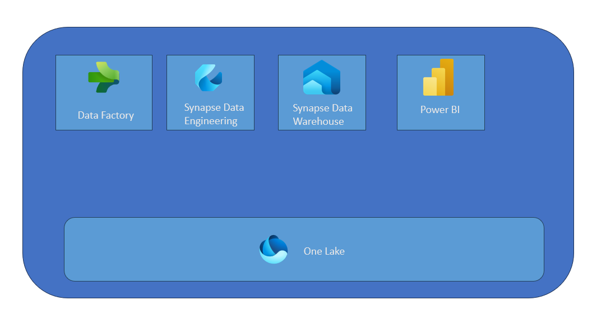

# Fabric Launcher
These blogs are built  to understand what is Microsoft Fabric and help derive value out of data. We will start with batch analysis and then progress into real-time and machine learning capabilites.

## What is Microsoft Fabric ?  
Microsoft Fabric can be thought of as an office for your orginizational data. Just like you are used to word/powerpoint/excel in office , fabric offers you a suite of tooling to work and create insights from your data. This provides an office like experience on your data estate.

## What challenge does it solve ?  
Microsoft Offers a wide range of tooling for data analysis. This choice usually leaves the customers overwhelmed and at the same time surfaces a lot of integration overhead. Fabric is trying to simplify this part for you by offering a SaaS platform to work and create insights from your data.

## Getting Started  

In any organization deriving value from data assets have a common path. It starts with gathering your data , curating it to understand what they mean and finally generating business value from it.  Let us break these sections down , which will help us grasp how does microsoft fabric help here.  

Gathering data could be either real/near real time or in a regular interval which could be scheduled to run at a particular interval.

### Batch Architecture Microsoft Fabric

###  Collecting Data

Fabric provides one storage layer per tenant. This is called [OneLake](https://learn.microsoft.com/en-us/fabric/onelake/onelake-overview). This helps gets rid of the overhead of managing and securing multiple storage accounts. The whole organization would have governed access to one lake which functions as your "one drive for your organization's data".

In order to load the data to your storage layer Fabric offers you [Data Factory](https://learn.microsoft.com/en-us/fabric/data-factory/data-factory-overview). If you are coming from a power bi world , data flows are inside the data factory component too. Capabiliites like fastcopy are integrated which will help you to load data at blazing fast speeds.

This allows you to copy data for analysis into your single storage layer. Next stage is to curate / prepare raw data for analysis.

### Curate Data  

Data in its raw format is difficult to use. Reson for this are the way the data is structured , data quality issues , technical nature of columns due to which they are difficult to interpret for a normal business user. In order to handle this raw data needs to be cleaned , curated to be ready for deriving value.  

Microsoft Fabric opens up these capabilites , by exposing tooling for both low-code/no-code citizen developers and code-first data engineeering personas. For users who are coming from a bi-background , [Data Factory](https://learn.microsoft.com/en-us/fabric/data-factory/data-factory-overview) , allows you to apply transformations on the data and get it ready for analysis. Familiarity with using DataFlows in Power BI will help you pick up Data Flow Gen2 capabilities on Fabric , which are used for data tranformations.  

Users who are coming from a sql background , fabric offers [Synapse Data Warehouse](https://learn.microsoft.com/en-us/fabric/data-warehouse/data-warehousing) , which lets you curate the data using stored procedures. Last but not the least for code-first data engineering personas , who prefer spark , [Synapse Data Engineering](https://learn.microsoft.com/en-us/fabric/data-engineering/data-engineering-overview) provides you a spark notebook experience to transform your data at scale. 

### Create Insights  

After your data is curated and ready the next step is to use this to create real business value. Fabric has the best in class BI tooling [Power BI](https://learn.microsoft.com/en-us/power-bi/fundamentals/power-bi-overview) component to enable you to achive this. In a world of data driven decisions , time to detect singals and adjust are curtial.  

This would madate these singals (changes in data) to be available inside the reports as soon as they appear in the data. Power BI has come up with [Direct Lake](https://learn.microsoft.com/en-us/fabric/data-engineering/lakehouse-pbi-reporting) , which does exactly this. This allows your reports to be fed with the latest data with blazing fast performance.
