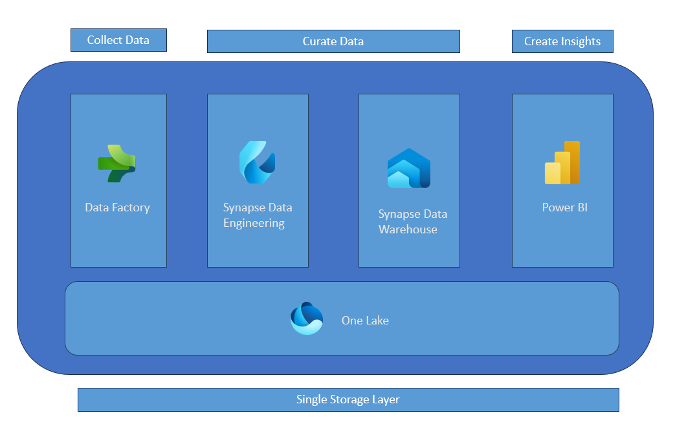

# Fabric Launcher
These blogs are built  to understand what is Microsoft Fabric and help derive value out of data. 

## What is Microsoft Fabric ?  
Microsoft Fabric can be thought of as an office for your orginizational data. Just like you are used to word/powerpoint/excel in office , fabric offers you a suite of tooling to work and create insights from your data. This provides an office like experience on your data estate.

## What challenge does it solve ?  
Microsoft Offers a wide range of tooling for data analysis. This choice usually leaves the customers overwhelmed and at the same time surfaces a lot of integration overhead. Fabric is trying to simplify this part for you by offering a SaaS platform to work and create insights from your data.

## Getting Started  

In any organization deriving value from data assets have a common path. It starts with gathering your data , curating it to understand what they mean and finally generating business value from it.  Let us break these sections down , which will help us grasp how does microsoft fabric help here.  

Gathering data could be either real/near real time or in a regular interval which could be scheduled to run at a particular interval.

### Batch Architecture Microsoft Fabric

### Gathering your Data / Collecting Data

Fabric provides one storage layer per tenant. This is called [OneLake](https://learn.microsoft.com/en-us/fabric/onelake/onelake-overview). This helps gets rid of the overhead of managing and securing multiple storage accounts. The whole organization would have governed access to one lake which functions as your "one drive for your organization's data".

In order to load the data to your storage layer Fabric offers you [Data Factory](https://learn.microsoft.com/en-us/fabric/data-factory/data-factory-overview). If you are coming from a power bi world , data flows are inside the data factory component too. Capabiliites like fastcopy are integrated which will help you to load data at blazing fast speeds.

To experience this first hand and find out the ease of use , lets start with [loading the data](/docs/load_data_factory.md) 

